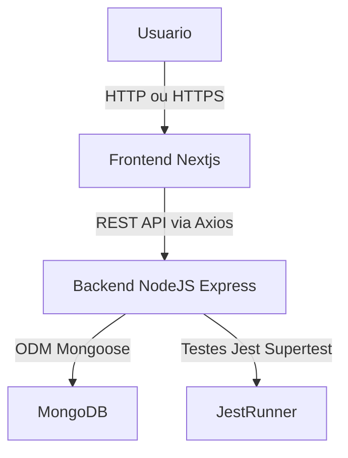

### Documento de Arquitetura — Networking Manager

- Arquitetura Monorepo com Frontend (Next.js) -> Backend (Node.js + Express) -> Banco NoSQL (MongoDB/Mongoose).
- O foco é o Fluxo de Admissão + funcionalidades de gestão, comunicação e geração de negócios.

---

## Diagrama da Arquitetura



Fluxo:
1. O usuário acessa o frontend via navegador.
2. O frontend consome o backend usando a API REST.
3. O backend manipula os dados e os persiste no MongoDB.
4. Os testes garantes a integridade e confiabilidade.

---

## Modelo de Dados (MongoDB — NoSQL)
- Modelo flexível (schemas variáveis) para evoluir rápido durante o protótipo/teste técnico.
- Bons drivers em Node.js; ótima compatibilidade com documentos que representam objetos do domínio (intents, invites, members, referrals).
- Facilidade para agregar relatórios usados em dashboards/relatórios.

# Coleções principais
intents — intenções de paticipação (porta de entrada)
```json
{
  "_id": ObjectId,
  "name": "Maria Silva",
  "email": "maria@mail.com",
  "phone": "+5511999",
  "business": "Marketing",
  "message": "Quero participar do grupo",
  "status": "pending", // pending | approved | rejected
  "admin_note": "observação",
  "createdAt": Date,
  "updatedAt": Date
}


invites — convites gerados ao aprovar uma intent

```json
{
  "_id": ObjectId,
  "intentId": ObjectId,        // reference -> intents._id
  "token": "uuid-or-random",   // usado para validação do link
  "expiresAt": Date,
  "used": false,
  "createdAt": Date
}

members — cadastros completos (membros ativos)
```json
{
  "_id": ObjectId,
  "name": "Maria Silva",
  "email": "maria@mail.com",
  "phone": "+5511999",
  "company": "Agência X",
  "position": "CEO",
  "bio": "...",
  "isActive": true,
  "joinedAt": Date,
  "meta": { /* campos livres */ }
}

referrals — indicações / referências de negócio
```json
{
  "_id": ObjectId,
  "fromMemberId": ObjectId,   // quem indicou
  "toMemberId": ObjectId,     // quem recebe a indicação
  "title": "Lead: Empresa Y",
  "description": "...",
  "contact": { "name": "", "phone":"", "email": "" },
  "status": "open",          // open | contacted | qualified | won | lost
  "createdAt": Date,
  "updatedAt": Date
}

meetings — reuniões 1:1 e eventos
```json
{
  "_id": ObjectId,
  "type": "one_to_one",        // one_to_one | group | event
  "participants": [ObjectId],  // members
  "date": Date,
  "location": "Zoom / local",
  "checkins": [{
     "memberId": ObjectId,
     "checkedAt": Date
  }],
  "notes": "..."
}

announcements — avisos e comunicados
```json
{
  "_id": ObjectId,
  "title": "Reunião de Junho",
  "body": "...",
  "authorId": ObjectId,
  "pinned": false,
  "audience": "all" , // or array of groups
  "createdAt": Date
}

payments — financeiro / mensalidades
```json
{
  "_id": ObjectId,
  "memberId": ObjectId,
  "period": "2025-09",
  "amount": 100.00,
  "status": "pending", // pending | paid | late
  "dueDate": Date,
  "paidAt": Date,
  "gateway": { "txId": "...", "provider": "stripe" }
}


