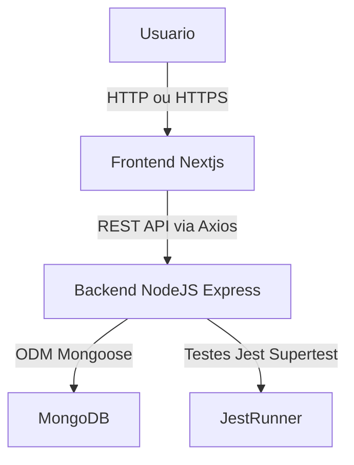

# Documento de Arquitetura — Networking Manager

- Arquitetura Monorepo com Frontend (Next.js) -> Backend (Node.js + Express) -> Banco NoSQL (MongoDB/Mongoose).
- O foco é o Fluxo de Admissão + funcionalidades de gestão, comunicação e geração de negócios.

---

## Diagrama da Arquitetura



### Fluxo:
1. O usuário acessa o frontend via navegador.
2. O frontend consome o backend usando a API REST.
3. O backend manipula os dados e os persiste no MongoDB.
4. Os testes garantem a integridade e confiabilidade.

---

## Modelo de Dados (MongoDB — NoSQL)

### Coleções principais

#### intents — intenções de participação
```json
{
  "_id": "ObjectId",
  "name": "João Pereira",
  "email": "joao.pereira@mail.com",
  "phone": "+55 21 98888-7777",
  "business": "Consultoria Financeira",
  "message": "Tenho interesse em participar do grupo",
  "status": "pending",
  "createdAt": "2025-11-07T18:00:00Z",
  "approvedBy": "ObjectId",
  "token": "uuid-gerado-para-cadastro"
}
```

#### invites — convites gerados ao aprovar uma intent
```json
{
  "_id": "ObjectId",
  "token": "d89ad1c8-4567-41e9-8c5e-0987654321ab",
  "intentionId": "ObjectId",
  "email": "joao.pereira@mail.com",
  "status": "valid",
  "expiresAt": "2025-12-01T00:00:00Z"
}
```

#### members — cadastros completos (membros ativos)
```json
{
  "_id": "ObjectId",
  "name": "Maria Silva",
  "email": "maria.silva@example.com",
  "phone": "+55 11 99999-8888",
  "business": "Marketing Digital",
  "role": "member",
  "status": "active",
  "joinedAt": "2025-11-08T10:00:00Z",
  "profile": {
    "company": "Agência XYZ",
    "position": "CEO",
    "linkedin": "https://linkedin.com/in/mariasilva"
  },
  "stats": {
    "referralsSent": 5,
    "referralsReceived": 3,
    "thanksGiven": 2,
    "thanksReceived": 1
  }
}
```

#### referrals — indicações / referências de negócio
```json
{
  "_id": "ObjectId",
  "fromMemberId": "ObjectId",
  "toMemberId": "ObjectId",
  "clientName": "Carlos Souza",
  "businessType": "Consultoria Empresarial",
  "description": "Indicação para análise de investimento",
  "status": "in_progress",
  "createdAt": "2025-11-06T14:00:00Z",
  "updatedAt": "2025-11-07T10:00:00Z"
}
```

#### meetings — reuniões 1:1 e eventos
```json
{
  "_id": "ObjectId",
  "title": "Reunião Semanal - Capítulo Alfa",
  "date": "2025-11-10T12:00:00Z",
  "location": "Espaço Coworking XYZ",
  "participants": [
    { "memberId": "ObjectId", "checkedIn": true, "checkInAt": "2025-11-10T12:05:00Z" },
    { "memberId": "ObjectId", "checkedIn": false }
  ]
}
```

#### announcements — avisos e comunicados
```json
{
  "_id": "ObjectId",
  "title": "Reunião Especial de Fim de Ano",
  "content": "Teremos uma confraternização e reunião especial no dia 20 de dezembro.",
  "authorId": "ObjectId",
  "createdAt": "2025-11-05T09:00:00Z",
  "visibleTo": ["members", "admins"]
}
```

#### payments — financeiro / mensalidades
```json
{
  "_id": "ObjectId",
  "memberId": "ObjectId",
  "month": "2025-11",
  "amount": 150.0,
  "status": "paid",
  "paidAt": "2025-11-05T12:00:00Z",
  "method": "pix",
  "reference": "mensalidade-2025-11"
}
```

---

## Estrutura de Componentes (Frontend — Next.js)

```bash
frontend/
└── src/
    ├── app/
    ├── components/
    │   ├── hooks/
    │   ├── layouts/
    │   ├── modules/
    │   ├── providers/
    │   └── ui/
    ├── services/
    ├── styles/
    └── utils/
```

### Padrões
- **ui/**: componentes visuais reutilizáveis.
- **modules/**: lógica de features (Intents, Cadastro, Referrals).
- **layouts/**: estrutura de página.
- **providers/**: Context API (admin, auth).
- **hooks/**: lógica compartilhada.
- **services/**: Axios e adapters para API REST.

---

## Definição de API — Endpoints Principais (REST)

### 1️⃣ Intents — Cadastro de intenção de participação

**POST /api/intents**
```json
{
  "name": "João Pereira",
  "email": "joao.pereira@mail.com",
  "phone": "+55 21 98888-7777",
  "business": "Consultoria Financeira",
  "message": "Tenho interesse em participar do grupo"
}
```

**Response:**
```json
{
  "id": "64b8efc5f47d2a001f9a4412",
  "status": "pending",
  "token": "dfadf8b2-3b12-48a1-aef1-8aa981b3d56d",
  "createdAt": "2025-11-07T18:00:00Z"
}
```

---

**GET /api/admin/intents**
```json
{
  "page": 1,
  "total": 32,
  "items": [
    {
      "id": "64b8efc5f47d2a001f9a4412",
      "name": "João Pereira",
      "status": "pending",
      "createdAt": "2025-11-07T18:00:00Z"
    }
  ]
}
```

---

### 2️⃣ Invites — Convites gerados ao aprovar uma intenção

**POST /api/invites/:intentId/approve**
```json
{
  "inviteId": "65b8ffb2a3c1a90010a4ee22",
  "intentionId": "64b8efc5f47d2a001f9a4412",
  "token": "d89ad1c8-4567-41e9-8c5e-0987654321ab",
  "status": "valid",
  "expiresAt": "2025-12-01T00:00:00Z"
}
```

**GET /api/invites/:token/validate**
```json
{
  "valid": true,
  "intentionEmail": "joao.pereira@mail.com",
  "expiresAt": "2025-12-01T00:00:00Z"
}
```

---

### 3️⃣ Members — Cadastro e gestão de membros

**POST /api/members**
```json
{
  "token": "d89ad1c8-4567-41e9-8c5e-0987654321ab",
  "name": "Maria Silva",
  "email": "maria.silva@example.com",
  "phone": "+55 11 99999-8888",
  "business": "Marketing Digital",
  "company": "Agência XYZ",
  "position": "CEO",
  "linkedin": "https://linkedin.com/in/mariasilva"
}
```

**Response:**
```json
{
  "memberId": "65c901a2f4f201c1b9c8d333",
  "status": "active",
  "joinedAt": "2025-11-08T10:00:00Z"
}
```

---

### 4️⃣ Referrals — Indicações

**POST /api/referrals**
```json
{
  "fromMemberId": "65c901a2f4f201c1b9c8d333",
  "toMemberId": "65c901a2f4f201c1b9c8d334",
  "clientName": "Carlos Souza",
  "businessType": "Consultoria Empresarial",
  "description": "Indicação para análise de investimento"
}
```

**Response:**
```json
{
  "referralId": "65c9aa4c334b0a1a81bc0aa2",
  "status": "in_progress",
  "createdAt": "2025-11-06T14:00:00Z"
}
```

---

### 5️⃣ Healthcheck

**GET /api/health**
```json
{
  "status": "ok",
  "db": "connected",
  "uptime": "13240s",
  "version": "1.0.0"
}
```