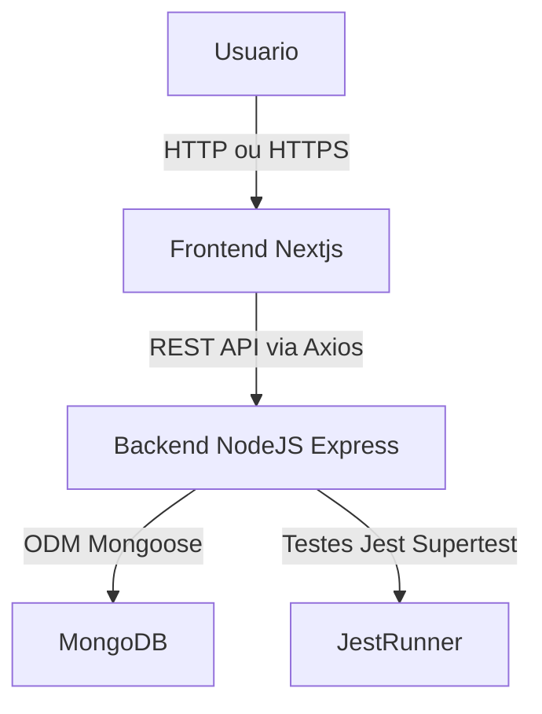

# Documento de Arquitetura — Networking Manager

- Arquitetura Monorepo com Frontend (Next.js) -> Backend (Node.js + Express) -> Banco NoSQL (MongoDB/Mongoose).
- O foco é o Fluxo de Admissão + funcionalidades de gestão, comunicação e geração de negócios.

---

## Diagrama da Arquitetura



### Fluxo:
1. O usuário acessa o frontend via navegador.
2. O frontend consome o backend usando a API REST.
3. O backend manipula os dados e os persiste no MongoDB.
4. Os testes garantes a integridade e confiabilidade.

---

## Modelo de Dados (MongoDB — NoSQL)
- Modelo flexível (schemas variáveis) para evoluir rápido durante o protótipo/teste técnico.
- Bons drivers em Node.js; ótima compatibilidade com documentos que representam objetos do domínio (intents, invites, members, referrals).
- Facilidade para agregar relatórios usados em dashboards/relatórios.

### Coleções principais
intents — intenções de paticipação (porta de entrada)
```json
{
  "_id": "ObjectId",
  "name": "João Pereira",
  "email": "joao.pereira@mail.com",
  "phone": "+55 21 98888-7777",
  "business": "Consultoria Financeira",
  "message": "Tenho interesse em participar do grupo",
  "status": "pending",
  "createdAt": "2025-11-07T18:00:00Z",
  "approvedBy": "ObjectId", 
  "token": "uuid-gerado-para-cadastro"
}
```

invites — convites gerados ao aprovar uma intent
```json
{
  "_id": "ObjectId",
  "token": "d89ad1c8-4567-41e9-8c5e-0987654321ab",
  "intentionId": "ObjectId",
  "email": "joao.pereira@mail.com",
  "status": "valid",
  "expiresAt": "2025-12-01T00:00:00Z"
}
```

members — cadastros completos (membros ativos)
```json
{
  "_id": "ObjectId",
  "name": "Maria Silva",
  "email": "maria.silva@example.com",
  "phone": "+55 11 99999-8888",
  "business": "Marketing Digital",
  "role": "member",
  "status": "active",
  "joinedAt": "2025-11-08T10:00:00Z",
  "profile": {
    "company": "Agência XYZ",
    "position": "CEO",
    "linkedin": "https://linkedin.com/in/mariasilva"
  },
  "stats": {
    "referralsSent": 5,
    "referralsReceived": 3,
    "thanksGiven": 2,
    "thanksReceived": 1
  }
}
```

referrals — indicações / referências de negócio
```json
{
  "_id": "ObjectId",
  "fromMemberId": "ObjectId",
  "toMemberId": "ObjectId",
  "clientName": "Carlos Souza",
  "businessType": "Consultoria Empresarial",
  "description": "Indicação para análise de investimento",
  "status": "in_progress",
  "createdAt": "2025-11-06T14:00:00Z",
  "updatedAt": "2025-11-07T10:00:00Z"
}
```

meetings — reuniões 1:1 e eventos
```json
{
  "_id": "ObjectId",
  "title": "Reunião Semanal - Capítulo Alfa",
  "date": "2025-11-10T12:00:00Z",
  "location": "Espaço Coworking XYZ",
  "participants": [
    { "memberId": "ObjectId", "checkedIn": true, "checkInAt": "2025-11-10T12:05:00Z" },
    { "memberId": "ObjectId", "checkedIn": false }
  ]
}
```

announcements — avisos e comunicados
```json
{
  "_id": "ObjectId",
  "title": "Reunião Especial de Fim de Ano",
  "content": "Teremos uma confraternização e reunião especial no dia 20 de dezembro.",
  "authorId": "ObjectId",
  "createdAt": "2025-11-05T09:00:00Z",
  "visibleTo": ["members", "admins"]
}
```

payments — financeiro / mensalidades
```json
{
  "_id": "ObjectId",
  "memberId": "ObjectId",
  "month": "2025-11",
  "amount": 150.0,
  "status": "paid",
  "paidAt": "2025-11-05T12:00:00Z",
  "method": "pix",
  "reference": "mensalidade-2025-11"
}
```

### Relacionamentos (NoSQL style)
- invites.intentId -> referência a intents._id (populate Mongoose).
- members referenciados em referrals.fromMemberId, referrals.toMemberId, meetings.participants, payments.memberId.

---

## Estrutura de componentes (Frontend — Next.js)
Objetivo: componetização atômica e modular, fácil teste e reutilização.

```bash
frontend/
└── src/
    ├── app/                # (App Router) rotas/pages se for App Router OR pages/ se Pages Router
    ├── components/
    │   ├── ui/             # componentes atômicos: Button, Input, Card, Modal, Avatar
    │   ├── layouts/        # wrappers: MainLayout, AdminLayout
    │   ├── modules/        # features de alto nível (FormIntent, AdminIntentsList, CadastroForm, ReferralsModule)
    │   ├── hooks/          # useAuth, useFetch, useForm, useToast
    │   └── providers/      # AdminProvider (token), MemberProvider (auth)
    ├── services/           # api client (axios), adapters e business services (intentsService.js)
    ├── styles/             # globals, tokens
    └── utils/              # validators, formatters
```

### Padrões e responsabilidades
- ui/: componentes puros, sem lógica de negócio; aceitam props e callbacks.
- modules/: combinam UI e serviços → contêm lógica específica de páginas/flows.
- layouts/: controlam cabeçalho, navegação, footers, e zonas de conteúdo.
- providers/: Context API para estado global: AdminContext (admin token), AuthContext (se implementar login), QueryClientProvider (react-query).
- hooks/: encapsulam reuso de lógica (ex: useInviteValidation(token), useIntents({page})).
- services/api.js: instancia axios com baseURL; interceptors para auth header, tratamento de erros.

### Estado global
- Admin token: store simples via AdminContext (variável de ambiente para dev; localStorage para persistência).
- Dados de sessão de membro: AuthContext com JWT quando implementar login.
- Caches/async: favor react-query para fetch/caching e invalidações (intents list, referrals, members).

---
