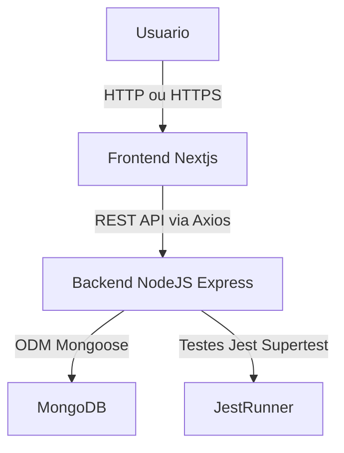

### Documento de Arquitetura — Networking Manager

- Arquitetura Monorepo com Frontend (Next.js) -> Backend (Node.js + Express) -> Banco NoSQL (MongoDB/Mongoose).
- O foco é o Fluxo de Admissão + funcionalidades de gestão, comunicação e geração de negócios.

---

## Diagrama da Arquitetura



Fluxo:
1. O usuário acessa o frontend via navegador.
2. O frontend consome o backend usando a API REST.
3. O backend manipula os dados e os persiste no MongoDB.
4. Os testes garantes a integridade e confiabilidade.


## Modelo de Dados (MongoDB — NoSQL)
- Modelo flexível (schemas variáveis) para evoluir rápido durante o protótipo/teste técnico.
- Bons drivers em Node.js; ótima compatibilidade com documentos que representam objetos do domínio (intents, invites, members, referrals).
- Facilidade para agregar relatórios usados em dashboards/relatórios.

# Coleções principais
intents — intenções de paticipação (porta de entrada)
```json
{
  "_id": ObjectId,
  "name": "Maria Silva",
  "email": "maria@mail.com",
  "phone": "+5511999",
  "business": "Marketing",
  "message": "Quero participar do grupo",
  "status": "pending", // pending | approved | rejected
  "admin_note": "observação",
  "createdAt": Date,
  "updatedAt": Date
}

